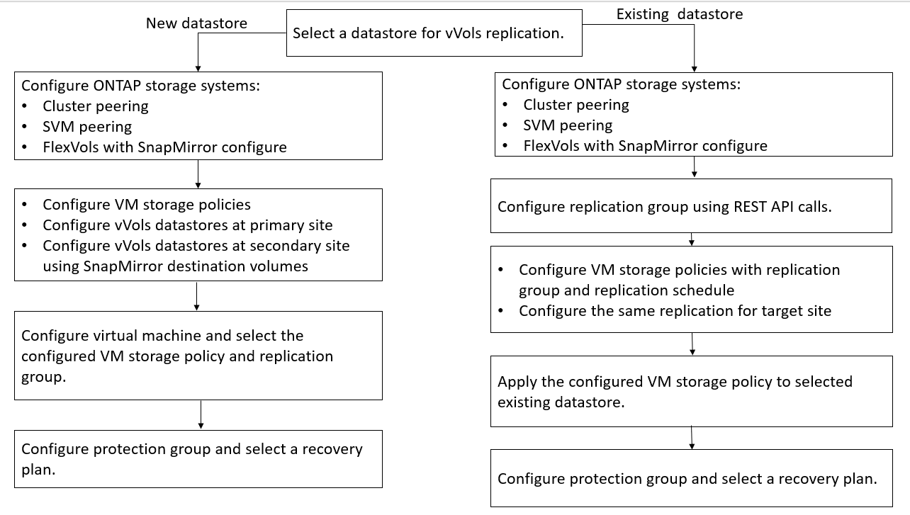

= Configurez la réplication vvols pour les datastores existants
:allow-uri-read: 
:icons: font
:imagesdir: ../media/

[role="lead"]
La fonction de réplication de vvols est améliorée afin de fournir une réplication de vvols pour les machines virtuelles existantes qui ont été créées avant la configuration de SRM. Vous pouvez ainsi restaurer les machines virtuelles existantes et les protéger sur le site de DR.

*Ce dont vous aurez besoin*

* Le cluster et SVM sont peering.
* Les datastores et les volumes FlexVol sont créés sur des sites source et cible.
* Les sites source et cible ont les mêmes profils de capacité de stockage.
* Les volumes FlexVol ont la même planification SnapMirror.
* La réplication de vvols est activée.

Aucun groupe de réplication n'est créé pour un datastore existant.

*Étapes*

. Accéder à l'interface de swagger.
. Exécutez l'API REST pour configurer le groupe de réplication pour le datastore existant.
+
API : /3.0/admin/{datastore}/Replication-groups

. Créez la stratégie de stockage de VM pour le datastore vvols existant avec le profil de capacité de stockage utilisé pour créer le datastore.
+
Ajoutez la stratégie de réplication, la planification de réplication et le datastore compatible dans la liste disponible.

NOTE: Si vous utilisez System Manager pour protéger les volumes FlexVol et le profil de capacité de stockage dispose d'une règle de QoS « aucun », assurez-vous que l'option *appliquer la limite de performances* est désactivée pour la reprise après incident.

. Accéder à la machine virtuelle non protégée et modifier la stratégie de stockage de la machine virtuelle.
. Sélectionnez la stratégie de stockage de VM et le datastore.
. Ajoutez le groupe de réplication à la machine virtuelle non protégée.

*REMARQUE :*

* Lors de la configuration d'une machine virtuelle afin de permettre la réplication pour les datastores existants, assurez-vous de vérifier le volume FlexVol doté d'une configuration vvols.
* Lorsque vVvols d'une machine virtuelle existante sont répartis entre plusieurs datastores, il est conseillé de déplacer tous les vvols de cette machine virtuelle à l'aide de vMotion vers un seul datastore avant de procéder à la réplication.

